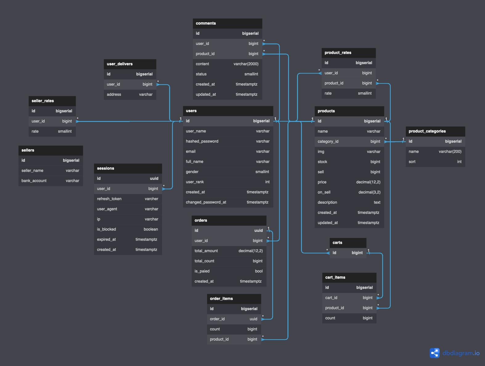

# go-commerce
- order transaction
- login interface 
- JWT token based authorization

# Database

# TODO:
- product list
- product type list
- product cart list
- thirth part payment
- thirth part authorization
